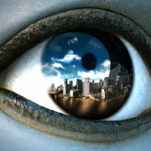

<h1 align="center">Soll-E</h1>

<h4 align="center">Soll-E is a web-based tool that leverages the power of AI to help you create images with just a few clicks. By entering your prompt, the OpenAI API generates images, that can be posted on the platform.</h4>

  <a href="#website">Website</a> &#x2022;
  <a href="#usage">Usage</a> &#x2022;
  <a href="#technologies">Technologies</a> &#x2022;
  <a href="#services">Services</a> 

## Website

Visit [Soll-E](https://soll-e.onrender.com)

## Usage

To generate an image, enter a prompt that describes the image you want to create. Once the image is generated, you can post and download it.

## Technologies

- React
- Vite
- Tailwind CSS
- Node.js
- MongoDB

## Services

- OpenAI AI
- Render
- Cloudinary
- MongoBD
